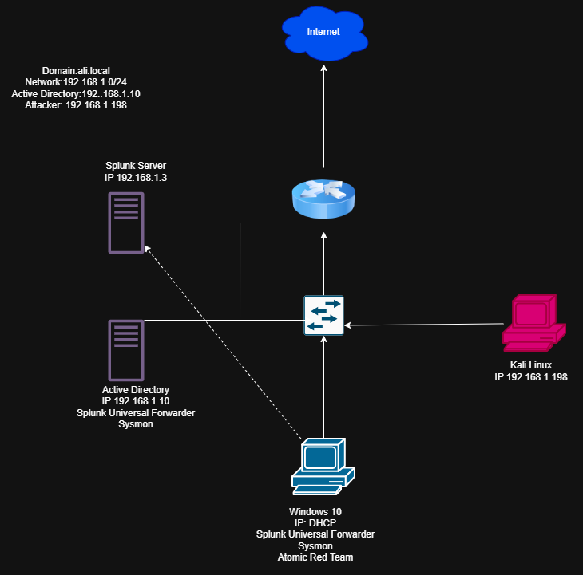

# Active Directory & SIEM Home Lab

A hands-on home lab simulating a small corporate environment with a Domain
Controller, endpoint monitoring, SIEM log collection, and live attack simulation.
Built entirely on VirtualBox using free/evaluation software.

---

## Architecture

---

## Host Inventory

| Host | Role | OS | IP Address | Tools Installed |
|---|---|---|---|---|
| Domain Controller | AD DS / DNS / DHCP | Windows Server 2022 | 192.168.1.10 | Sysmon, Splunk UF |
| Target Endpoint | Domain-joined client | Windows 10 | DHCP | Sysmon, Splunk UF, Atomic Red Team |
| SIEM | Log collection & analysis | Ubuntu Server | 192.168.1.3 | Splunk Enterprise |
| Attacker | Offensive simulation | Kali Linux | 192.168.1.198 | — |

**Network:** `192.168.1.0/24`  
**Domain:** `ali.local`

---

## What Was Built

### Active Directory
- Promoted Windows Server 2022 to a Domain Controller for `ali.local`
- Configured AD DS, DNS, and DHCP roles
- Created Organizational Units and user accounts via ADUC
- Domain-joined the Windows 10 client

### Endpoint Monitoring
- Deployed **Sysmon** on Windows hosts for granular process, network,
  and registry event logging
- Installed **Splunk Universal Forwarder** on both Windows hosts and
  pointed them at the Splunk server (`192.168.1.3`)

### SIEM (Splunk)
- Installed **Splunk Enterprise** on Ubuntu Server
- Configured inputs to receive forwarded Windows/Sysmon logs
- Built searches to surface attack telemetry

### Attack Simulation
- Ran an **RDP brute-force** from Kali Linux (`192.168.1.198`) against
  the Windows 10 target
- Executed **Atomic Red Team** techniques (MITRE ATT&CK-mapped) on the
  endpoint and confirmed detection in Splunk

---

## Skills Demonstrated

- Active Directory administration (AD DS, DNS, DHCP, OUs, users, domain join)
- Endpoint telemetry collection with Sysmon
- Log forwarding and SIEM ingestion with Splunk Universal Forwarder
- Adversary simulation — RDP brute-force and Atomic Red Team
- Detection engineering and log analysis in Splunk

---
